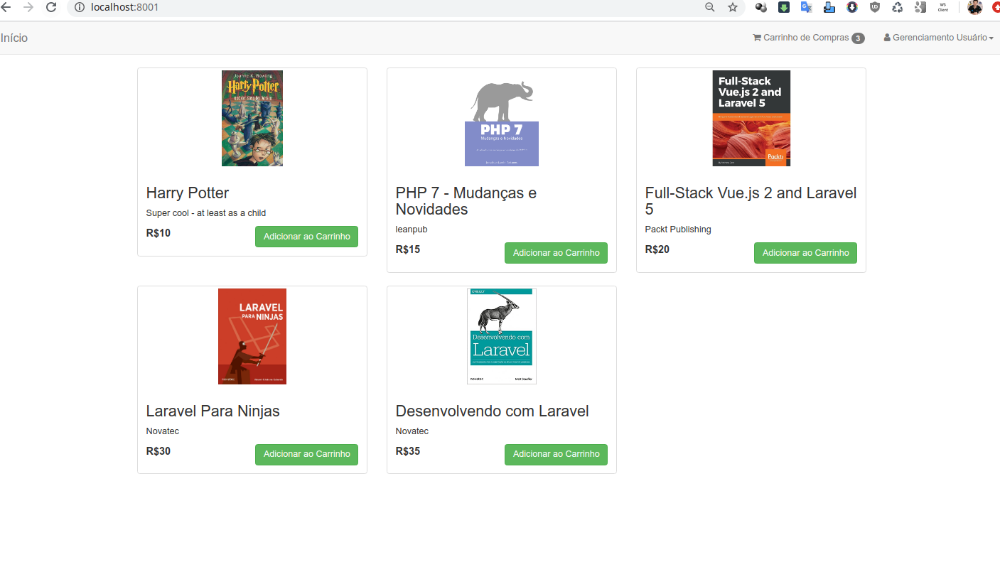
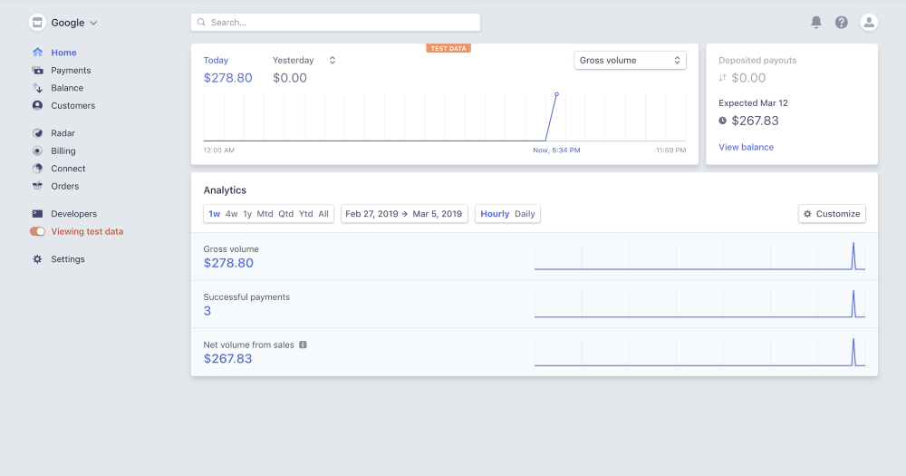

# Ecommerce de livros com Laravel 6

 


## laravel-stripe-payment

## Passos para utilizar

### composer update
### Configurar o arquivo .env com as configurações do banco
### php artisan migrate
### php artisan db:seed

```sh
    composer install
    php artisan migrate --seed
    php artisan key:generate
    php artisan serve --host=0.0.0.0 --port=8001
```

<p align="center"><a href="https://github.com/lucenarenato/Ecommerce_livros_Laravel-6" target="_blank"></a></p>


## api stripe - Laravel 7/6 Stripe Payment Integration

<p align="center"><a href="https://github.com/lucenarenato/Ecommerce_livros_Laravel-6" target="_blank"></a></p>

- https://www.itsolutionstuff.com/post/laravel-6-stripe-payment-integration-tutorialexample.html
- https://medium.com/@juangsalazprabowo/how-to-integrate-laravel-with-stripe-fc54e54a767c
- https://packagist.org/packages/stripe/stripe-php
- https://stripe.com/docs/api

## Renato Lucena